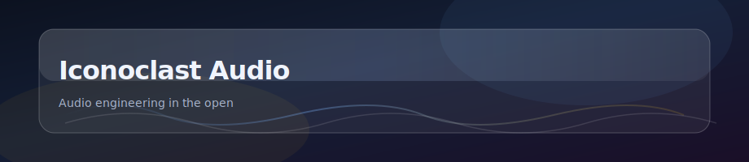
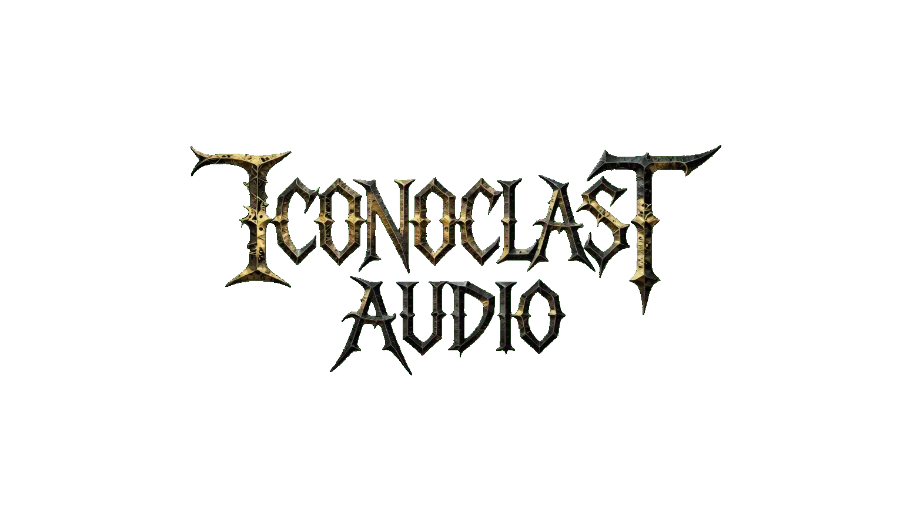
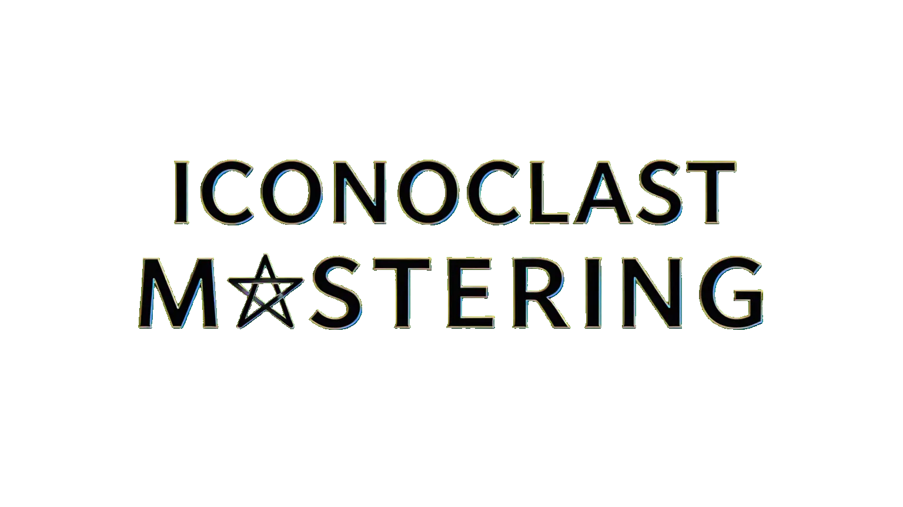

  
  

    <strong>Public hub</strong> for our work on GitHub — sound, tools, and how we build them. 
    GitHub READMEs can’t load custom styles; the glass look above is baked into the banner image.
  

  

    
    &nbsp;&nbsp;
    
  

  
Wordmark and blackletter logos (transparent PNGs; copies of <code>site/public/generated/logo/</code>).

  

    
     
    Site favicon: pen-style oni mask (<code>site/public/generated/icons/</code>).
  

---

## About

**Iconoclast Audio** is where we share **audio engineering** in public: experiments, releases, and process—not only polished demos.

**Canonical public site (not this README):** **[iconoclastaud.io](https://iconoclastaud.io/)** — static HTML from [`site/`](site/), which GitHub Pages publishes as the **site root** (not under a `/site/` URL path). This README only appears on GitHub.

| | |
| :--- | :--- |
| **Website (canonical)** | **[https://iconoclastaud.io/](https://iconoclastaud.io/)** — deployed with **GitHub Actions** (see [AGENTS.md](AGENTS.md)). |
| **GitHub Pages (project URL)** | `https://shahzebqazi.github.io/iconoclast/` — same files as `site/`. |
| **This repo** | **[github.com/shahzebqazi/iconoclast](https://github.com/shahzebqazi/iconoclast)** — hub, `docs/` (Markdown), and [`site/`](site/) (published site). |
| **Organization** | **[github.com/shahzebqazi](https://github.com/shahzebqazi)** — our other public repositories and projects. |

**Site map** (paths are under the domain root): `/`, `/ritual/`, `/rates/`, `/links/`, `/contact/`, `/legal/`, `/faq/`, `/404.html`. **Assets:** `site/public/` → **`/public/`** on the host (`npm run assets:build`). **Local preview:** `cd site && python3 -m http.server` → matches production paths.

## Documentation

| Doc | What you get |
| :--- | :--- |
| [**Executive summary**](docs/executive-summary.md) | Audience, direction, tone, and what we’re building toward. |
| [**AGENTS.md**](AGENTS.md) | For contributors and automation: layout, Pages, next steps. |

## Generated assets (MVP)

- **Build:** `npm install` then `npm run assets:build` — writes **`site/public/generated/`** and **`site/public/index.html`** (gallery with descriptions; catalog in `scripts/generate/assetCatalog.ts`). The build runs vector templates, then **`postprocessAiIcons.ts`** (oni favicons from `scripts/generate/ai-cache/`, circular fireball logo).
- **CI:** the Pages workflow runs the same build before deploy so `site/public/` stays in sync.
- See `assets/MVP_ASSETS.md` for what ships from generators vs what you still supply (photography, final logo, copy).
- Brand questions: `docs/BRAND_CONSULTATION.md`.

---

  Early days — rough edges are part of the record.

