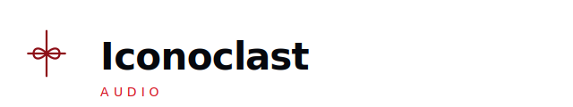

  
  

    <strong>Public hub</strong> for our work on GitHub — sound, tools, and how we build them. 
    Generated wordmark; the live site uses the dark-background variant in the nav.
  

---

## About

**Iconoclast Audio** is where we share **audio engineering** in public: experiments, releases, and process—not only polished demos.

**Canonical public site (not this README):** **[https://iconoclastaud.io/site/](https://iconoclastaud.io/site/)** — static HTML built from [`site/`](site/). Apex **`/`** redirects to **`/site/`** (repo root [`index.html`](index.html)); the GitHub README is repo documentation only.

| | |
| :--- | :--- |
| **Website (canonical)** | **[https://iconoclastaud.io/site/](https://iconoclastaud.io/site/)** — deployed with **GitHub Actions** (see [AGENTS.md](AGENTS.md)). |
| **GitHub Pages (project URL)** | `https://shahzebqazi.github.io/iconoclast/site/` — same content under **`/site/`**. |
| **This repo** | **[github.com/shahzebqazi/iconoclast](https://github.com/shahzebqazi/iconoclast)** — hub, `docs/` (Markdown), and [`site/`](site/) (published site source). |
| **Organization** | **[github.com/shahzebqazi](https://github.com/shahzebqazi)** — our other public repositories and projects. |

**Site map** (paths on the live host are under **`https://iconoclastaud.io/site/`**): home, `ritual/`, `rates/`, `links/`, `contact/`, `legal/`, `faq/`, `design/palette.html`, `design/typography.html`, `404.html`. **Styling:** one flat stylesheet, `site/style.css` — Bauhaus palette, no glass panels or card UI on the public pages. **Asset gallery** (generated): **`/site/public/`** — `npm run assets:build` (same CSS as the main site). **Local preview:** `cd site && python3 -m http.server` → paths match production without the `/site/` prefix.

## Documentation

| Doc | What you get |
| :--- | :--- |
| [**Executive summary**](docs/executive-summary.md) | Audience, direction, tone, and what we’re building toward. |
| [**AGENTS.md**](AGENTS.md) | For contributors and automation: layout, Pages, next steps. |

## Generated assets (MVP)

- **Build:** `npm install` then `npm run assets:build` — writes **`site/public/generated/`** and **`site/public/index.html`** (flat asset index; catalog in `scripts/generate/assetCatalog.ts`).
- **CI:** the Pages workflow runs the same build before deploy so `site/public/` stays in sync.
- See `assets/MVP_ASSETS.md` for what ships from generators vs what you still supply (photography, final logo, copy).
- Brand questions: `docs/BRAND_CONSULTATION.md`.

---

  Early days — rough edges are part of the record.

